# Application Workflows: Grey Literature Search App

This document details the key workflows in the Grey Literature Search App, providing a step-by-step breakdown of user journeys and system processes.

## Table of Contents

1. [User Authentication Workflows](#user-authentication-workflows)
2. [Search Builder Workflows](#search-builder-workflows)
3. [Search Execution Workflows](#search-execution-workflows)
4. [Results Management Workflows](#results-management-workflows)
5. [User Interface Workflows](#user-interface-workflows)

## User Authentication Workflows

### New User Registration

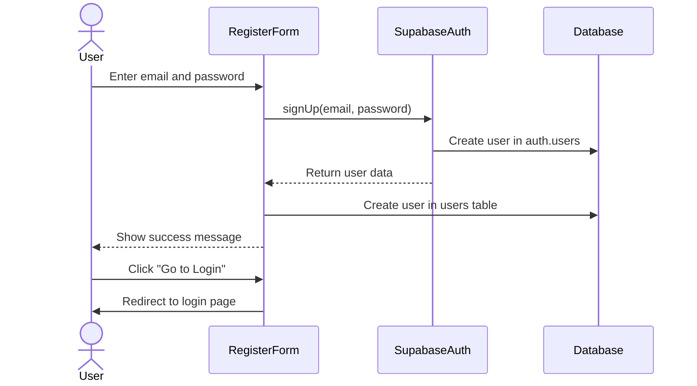

**Implementation Details:**

1. User enters email and password in `RegisterForm` component (`src/components/auth/RegisterForm.tsx`)
2. Form validation ensures password requirements are met
3. On form submission, `supabase.auth.signUp()` is called with user credentials
4. On successful registration, user data is synchronized with the application database
5. Success message is displayed with option to go to login page

### User Login

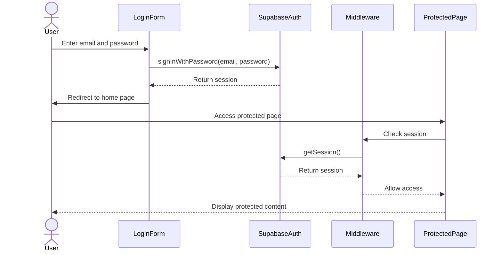

**Implementation Details:**

1. User enters email and password in `LoginForm` component (`src/components/auth/LoginForm.tsx`)
2. On form submission, `supabase.auth.signInWithPassword()` is called with user credentials
3. On successful login, session is established and stored in cookies
4. User is redirected to the home page
5. When accessing protected pages, middleware checks for valid session
6. If session is valid, user is allowed access to protected content

### User Logout

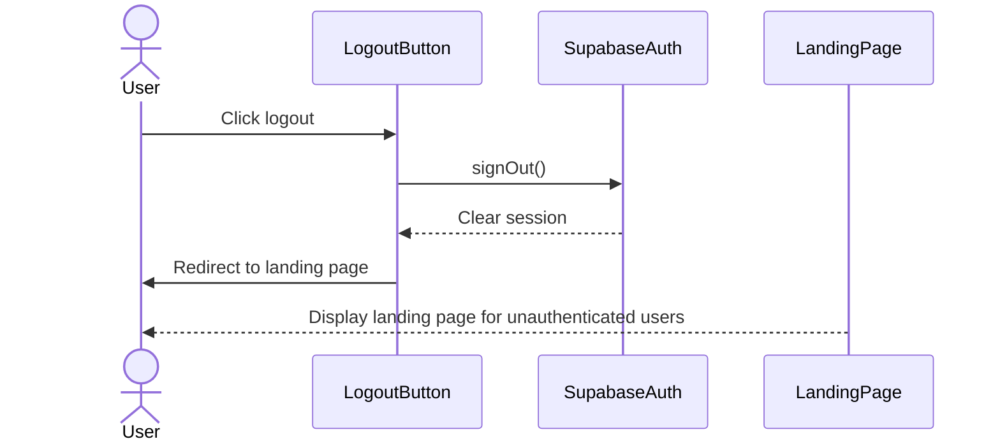

**Implementation Details:**

1. User clicks logout button (`src/components/auth/LogoutButton.tsx`)
2. `supabase.auth.signOut()` is called to end the session
3. Local storage items related to the session are cleared
4. User is redirected to the landing page
5. Landing page displays content for unauthenticated users

## Search Builder Workflows

### Creating a New Search

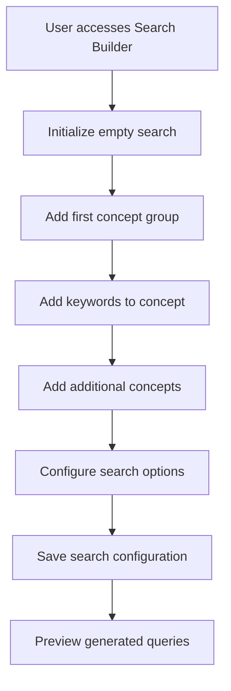

**Implementation Details:**

1. User accesses the Search Builder page (`src/app/search-builder/page.tsx`)
2. Empty search is initialized with default settings
3. User adds concept groups using the `ConceptGroup` component (`src/components/search/ConceptGroup.tsx`)
4. For each concept, user adds keywords using the `KeywordInput` component (`src/components/search/KeywordInput.tsx`)
5. User configures search options (domains, filters, etc.)
6. Search configuration is saved to local storage and/or database
7. Generated search queries are previewed using the `SearchPreview` component (`src/components/search/SearchPreview.tsx`)

### Editing an Existing Search

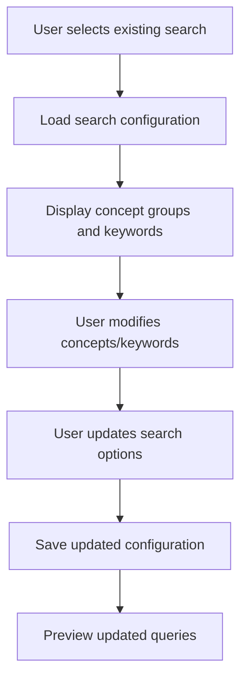

**Implementation Details:**

1. User selects an existing search from the list
2. Search configuration is loaded from the database
3. Concept groups and keywords are displayed in the UI
4. User modifies concepts and keywords as needed
5. User updates search options
6. Updated configuration is saved to the database
7. Updated search queries are previewed

## Search Execution Workflows

### Executing a Search

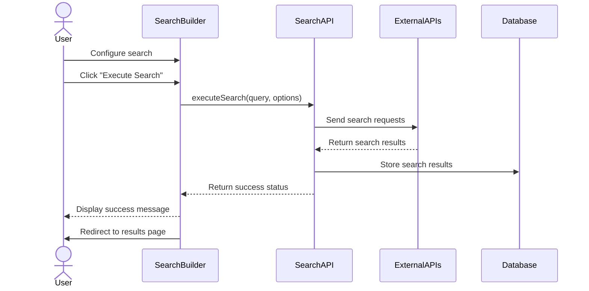

**Implementation Details:**

1. User configures search in the Search Builder
2. User clicks "Execute Search" button
3. Search request is sent to the Search API (`src/server/api/routers/search.ts`)
4. Search API processes the request and executes searches against external APIs
5. Results are processed and stored in the database
6. Success status is returned to the client
7. User is redirected to the results page

### Monitoring Search Progress

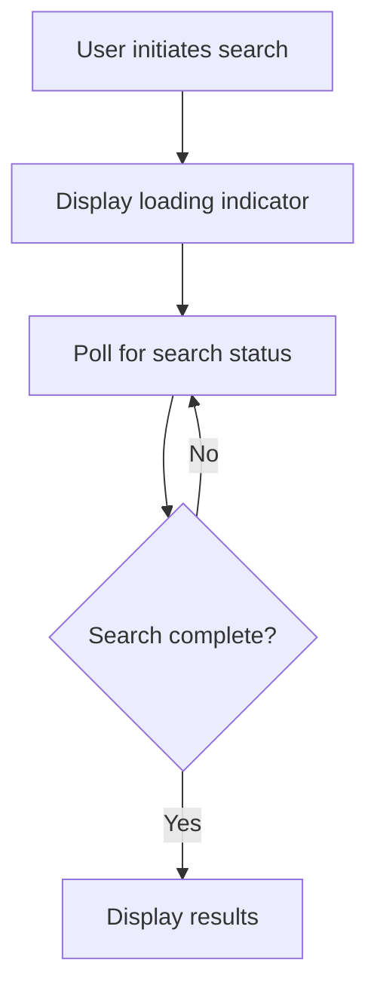

**Implementation Details:**

1. User initiates a search
2. Loading indicator is displayed
3. Client polls the server for search status
4. When search is complete, results are displayed

## Results Management Workflows

### Viewing Search Results

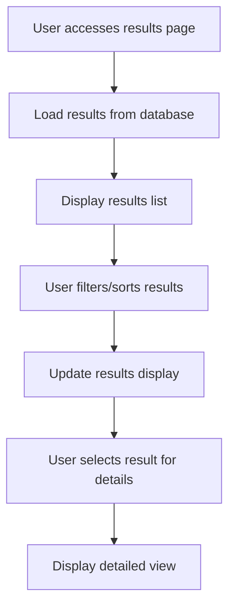

**Implementation Details:**

1. User accesses the results page
2. Results are loaded from the database
3. Results are displayed in a list view
4. User can filter and sort results
5. Results display is updated based on filters/sorting
6. User can select a result to view details
7. Detailed view of the result is displayed

### Tagging and Categorizing Results

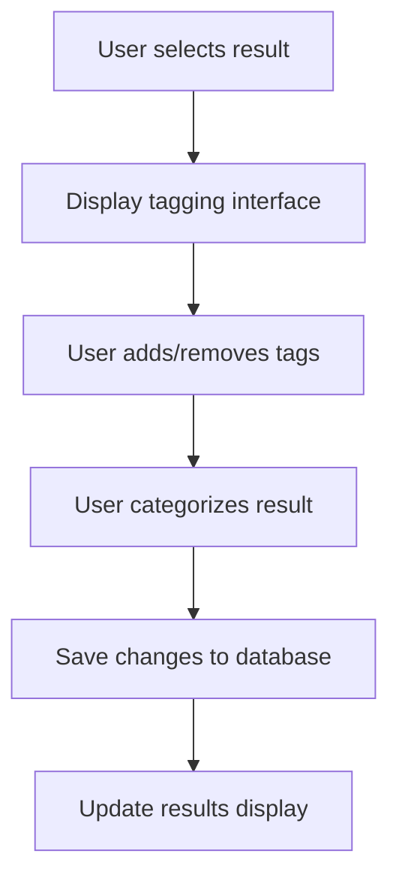

**Implementation Details:**

1. User selects a result
2. Tagging interface is displayed
3. User can add or remove tags
4. User can categorize the result
5. Changes are saved to the database
6. Results display is updated to reflect changes

## User Interface Workflows

### Navigation Flow

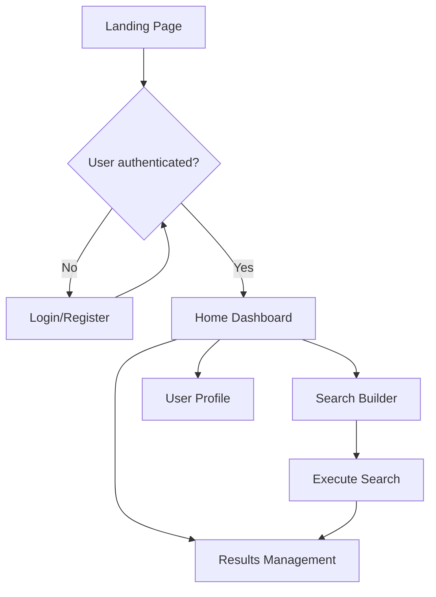

**Implementation Details:**

1. User lands on the landing page (`src/components/landing/LandingPage.tsx`)
2. If not authenticated, user is presented with login/register options
3. After authentication, user is directed to the home dashboard
4. From the dashboard, user can navigate to various sections of the application
5. Navigation is handled by Next.js App Router

### Responsive Design Adaptation

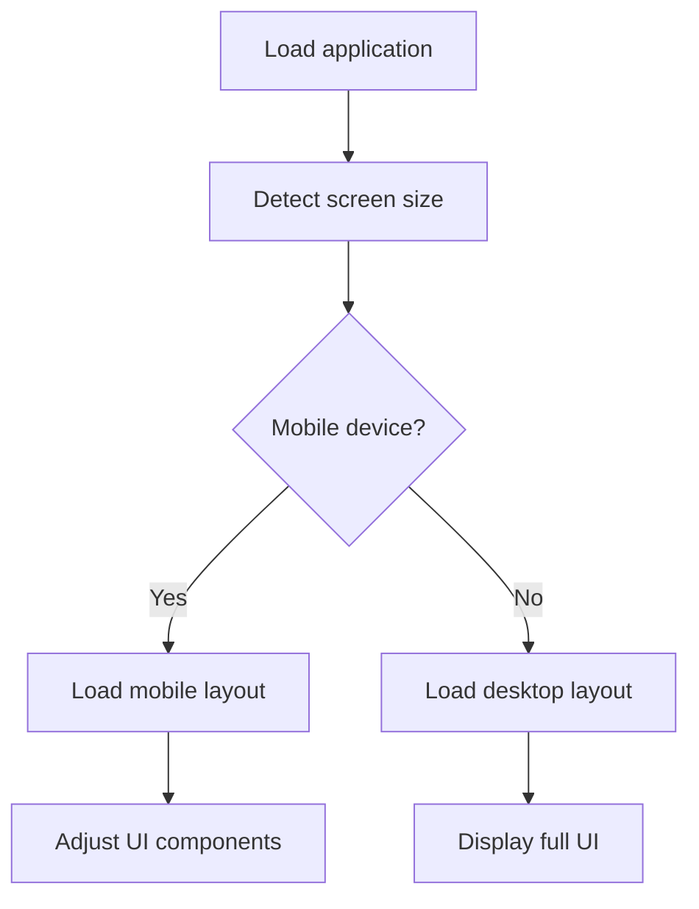

**Implementation Details:**

1. Application loads and detects screen size
2. Based on screen size, appropriate layout is loaded
3. UI components adjust based on the device
4. Responsive design is implemented using Tailwind CSS responsive classes

## Conclusion

This document provides a detailed overview of the key workflows in the Grey Literature Search App. It should be used in conjunction with the Developer Handover and Technical Architecture documents to understand how the application functions and how users interact with it.

For more detailed information on specific components or implementation details, refer to the codebase and additional documentation in the `docs` directory.
