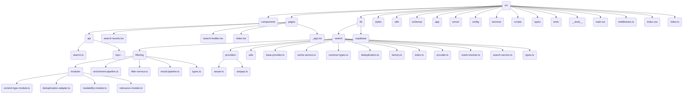

```mermaid
graph TD
    A(src) --> B(components);
    A --> C(pages);
        C --> C_API(api);
            C_API --> CA1(search.ts);
            C_API --> CA2(trpc/...);
        C --> C1(search-results.tsx);
        C --> C2(search-builder.tsx);
        C --> C3(index.tsx);
        C --> C4(_app.tsx);
    A --> D(lib);
        D --> D_SEARCH(search);
            D_SEARCH --> DS_FILTERING(filtering);
                DS_FILTERING --> DSF_MODULES(modules);
                    DSF_MODULES --> DSFM1(content-type-module.ts);
                    DSF_MODULES --> DSFM2(deduplication-adapter.ts);
                    DSF_MODULES --> DSFM3(readability-module.ts);
                    DSF_MODULES --> DSFM4(relevance-module.ts);
                DS_FILTERING --> DSF1(enrichment-pipeline.ts);
                DS_FILTERING --> DSF2(filter-service.ts);
                DS_FILTERING --> DSF3(result-pipeline.ts);
                DS_FILTERING --> DSF4(types.ts);
            D_SEARCH --> DS_PROVIDERS(providers);
                DS_PROVIDERS --> DSP1(serper.ts);
                DS_PROVIDERS --> DSP2(serpapi.ts);
            D_SEARCH --> DS_UTILS(utils);
            D_SEARCH --> DS1(base-provider.ts);
            D_SEARCH --> DS2(cache-service.ts);
            D_SEARCH --> DS3(common-types.ts);
            D_SEARCH --> DS4(deduplication.ts);
            D_SEARCH --> DS5(factory.ts);
            D_SEARCH --> DS6(index.ts);
            D_SEARCH --> DS7(provider.ts);
            D_SEARCH --> DS8(result-resolver.ts);
            D_SEARCH --> DS9(search-service.ts);
            D_SEARCH --> DS10(types.ts);
        D --> D_SUPABASE(supabase);
    A --> E(styles);
    A --> F(utils);
    A --> G(schemas);
    A --> H(app);
    A --> I(server);
    A --> J(config);
    A --> K(services);
    A --> L(scripts);
    A --> M(types);
    A --> N(tests);
    A --> O(__tests__);
    A --> P(main.tsx);
    A --> Q(middleware.ts);
    A --> R(index.css);
    A --> S(index.ts);
``` 