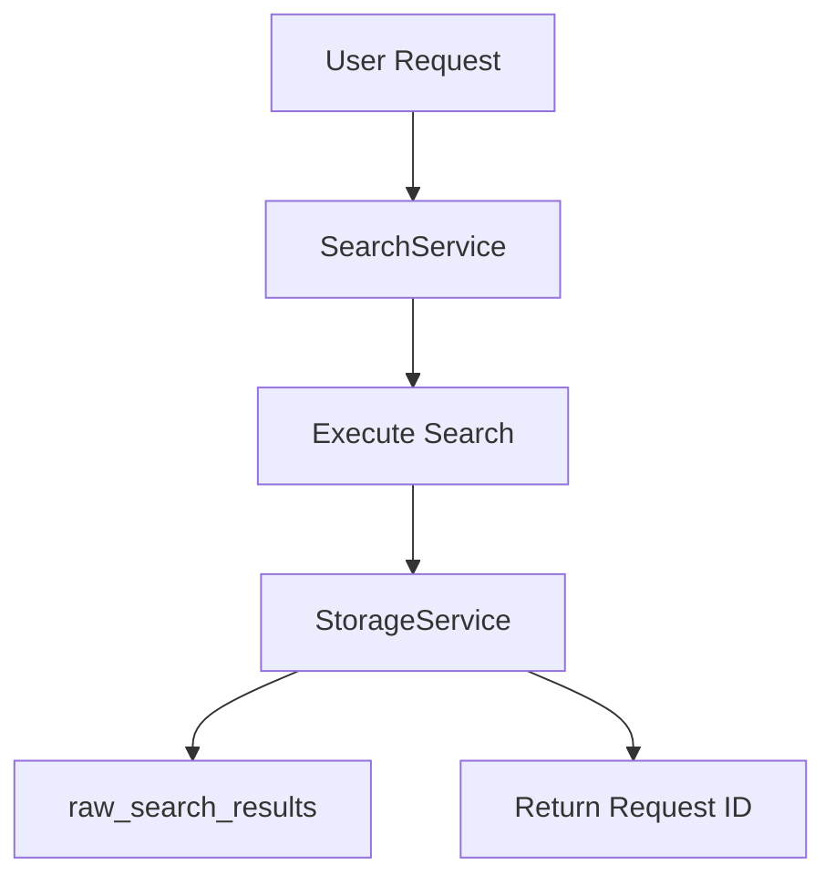
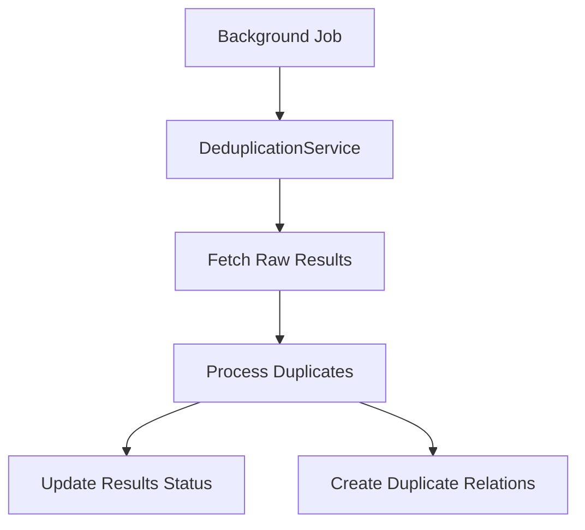

# Search Workflow Refactoring Plan
*Restructuring the search pipeline for better modularity and data integrity*

## 🎯 Objectives

1. Separate deduplication from search service
2. Preserve raw search results
3. Align implementation with clean architecture
4. Improve PRISMA tracking capabilities

## 📊 Database Schema Updates

### New Tables

1. `raw_search_results`
```sql
CREATE TABLE raw_search_results (
    id UUID PRIMARY KEY,
    search_request_id UUID NOT NULL,
    title TEXT NOT NULL,
    url TEXT NOT NULL,
    source TEXT NOT NULL,
    metadata JSONB,
    created_at TIMESTAMP NOT NULL,
    FOREIGN KEY (search_request_id) REFERENCES search_requests(id)
);
```

2. `duplicate_relationships`
```sql
CREATE TABLE duplicate_relationships (
    id UUID PRIMARY KEY,
    original_result_id UUID NOT NULL,
    duplicate_result_id UUID NOT NULL,
    confidence_score FLOAT,
    created_at TIMESTAMP NOT NULL,
    FOREIGN KEY (original_result_id) REFERENCES search_results(id),
    FOREIGN KEY (duplicate_result_id) REFERENCES search_results(id)
);
```

### Modified Tables

1. `search_results`
- Add `status` column: ENUM('raw', 'processed', 'duplicate')
- Add `duplicate_of_id` column (nullable UUID)
- Add `processing_metadata` JSONB column

## 🔄 New Service Structure

### 1. SearchService
- Responsibility: Execute searches and store raw results
- Location: `src/lib/search/search-service.ts`
- Dependencies: StorageService

### 2. StorageService
- Responsibility: Handle all database operations
- Location: `src/lib/search/services/storage-service.ts`
- Key methods:
  - `saveRawResults()`
  - `markDuplicates()`
  - `getRawResults()`

### 3. DeduplicationService
- Responsibility: Process raw results and identify duplicates
- Location: `src/lib/search/services/deduplication-service.ts`
- Dependencies: StorageService

## 📋 Implementation Steps

### Phase 1: Database Migration
1. Create new tables
2. Modify existing tables
3. Create indexes for performance
4. Write data migration script for existing results

### Phase 2: Service Implementation
1. Create StorageService
2. Implement DeduplicationService
3. Modify SearchService
4. Update ResultsManager

### Phase 3: API Updates
1. Update endpoints to reflect new workflow
2. Add status tracking endpoints
3. Implement background processing

## 🔍 New Search Workflow

1. Search Execution:


2. Deduplication Process:


## 🧪 Testing Strategy

1. Unit Tests:
   - SearchService
   - StorageService
   - DeduplicationService

2. Integration Tests:
   - Complete workflow
   - Database operations
   - Background processing

3. Migration Tests:
   - Data integrity
   - Performance impact

## 📊 Metrics to Track

1. Processing Performance:
   - Raw storage time
   - Deduplication processing time
   - End-to-end latency

2. Quality Metrics:
   - Duplicate detection accuracy
   - False positive rate
   - Processing success rate

## 🚀 Deployment Plan

1. Database Updates:
   - Apply migrations in staging
   - Verify data integrity
   - Apply in production

2. Service Deployment:
   - Deploy new services
   - Enable feature flag
   - Gradual rollout

3. Monitoring:
   - Set up alerts
   - Track error rates
   - Monitor performance

## 🎯 Success Criteria

1. Technical:
   - All raw results preserved
   - Deduplication running asynchronously
   - Clean separation of concerns
   - Improved PRISMA tracking

2. Performance:
   - Search response time ≤ current
   - Deduplication accuracy ≥ 95%
   - Zero data loss

## 📝 Documentation Updates Required

1. API Documentation:
   - New endpoints
   - Modified response formats
   - Status codes

2. Architecture Docs:
   - Updated flow diagrams
   - Service interactions
   - Data model changes

3. Monitoring Docs:
   - New metrics
   - Alert thresholds
   - Troubleshooting guides