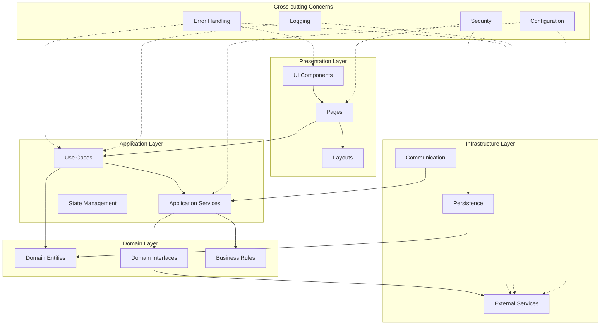

# Grey Literature Search App - Architecture Documentation

## Architecture Overview

The Grey Literature Search App follows a Clean Architecture pattern with Next.js App Router, organizing the application into distinct layers with clear responsibilities and dependencies. This architecture ensures separation of concerns, maintainability, and testability while leveraging the strengths of Next.js for server-side rendering and API routes.


<details>
<summary>Diagram Source</summary>


</details>

## Core Layers

### Domain Layer

The Domain Layer contains the core business logic and entities independent of any external frameworks or technologies.

**Responsibilities:**
- Define core domain entities (User, SearchRequest, SearchResult, ReviewTag, etc.)
- Establish domain interfaces for services
- Implement core business rules (deduplication logic, PRISMA metrics calculation)

**Key Components:**
- **Entities**: Represent the core data structures of the application
  - `User`: Represents an authenticated user
  - `SearchRequest`: Contains search strategy configuration
  - `SearchResult`: Represents a normalized search result
  - `ReviewTag`: Stores user decisions on search results
  - `DuplicateLog`: Tracks removed duplicates for PRISMA reporting

- **Interfaces**: Define contracts for services
  - `ISearchService`: Contract for search execution
  - `IAuthService`: Contract for authentication operations
  - `IStorageService`: Contract for data persistence

- **Business Rules**: Encapsulate core application logic
  - URL normalization for consistent comparison
  - Deduplication algorithms
  - PRISMA metrics calculation

### Application Layer

The Application Layer orchestrates the flow of data and coordinates domain operations.

**Responsibilities:**
- Implement use cases that represent user interactions
- Coordinate between domain entities and infrastructure services
- Manage application state

**Key Components:**
- **Use Cases**: Represent specific user interactions
  - `AuthUseCase`: Handle user registration and authentication
  - `SearchStrategyUseCase`: Manage search strategy building
  - `SerpExecutionUseCase`: Execute search queries via APIs
  - `ResultsManagementUseCase`: Handle result deduplication and storage
  - `ReviewUseCase`: Manage the review workflow
  - `ExportUseCase`: Generate reports in various formats

- **Application Services**: Implement domain interfaces
  - `SearchService`: Implements ISearchService
  - `AuthService`: Implements IAuthService
  - `StorageService`: Implements IStorageService

- **State Management**: Manage application state
  - Server-side state with client hydration
  - React state management for UI components

### Infrastructure Layer

The Infrastructure Layer provides concrete implementations of interfaces defined in the domain layer.

**Responsibilities:**
- Implement external service integrations
- Provide data persistence mechanisms
- Handle communication protocols

**Key Components:**
- **External Services**: Integrate with third-party services
  - `SupabaseClient`: Interface with Supabase services
  - `SerpApiClient`: Interface with search engine APIs
  - `ResendClient`: Interface with email service

- **Persistence**: Handle data storage
  - `PrismaClient`: ORM for database operations
  - `SupabaseStorage`: File storage for exports

- **Communication**: Handle API communication
  - tRPC router for type-safe API endpoints
  - Next.js API routes for external communication

### Presentation Layer

The Presentation Layer handles the user interface and user interactions.

**Responsibilities:**
- Render UI components
- Handle user input
- Display application state

**Key Components:**
- **Pages**: Next.js pages for routing
  - Authentication pages
  - Search Strategy Builder
  - Results Review
  - Export

- **Components**: Reusable UI elements
  - Form components
  - Table components
  - Modal components

- **Layouts**: Page structure and navigation
  - Main layout with navigation
  - Authentication layout

## Cross-cutting Concerns

### Error Handling

A centralized error handling system that spans all layers of the application.

**Implementation:**
- Custom error classes for different error types
- Error boundaries in React components
- Consistent error response format for API endpoints
- Error logging and monitoring

### Logging

Structured logging with context to track application behavior and diagnose issues.

**Implementation:**
- Logging middleware for API requests
- Structured log format with context
- Different log levels for development and production

### Security

Security measures to protect user data and prevent unauthorized access.

**Implementation:**
- JWT validation for authentication
- CSRF protection for forms
- Row Level Security in Supabase
- Input validation with Zod

### Configuration

Environment-based configuration with strong typing.

**Implementation:**
- Environment variables with validation
- Configuration service for accessing settings
- Different configurations for development and production

## Integration Patterns

### External Service Integration

The Adapter pattern is used to integrate with external services, providing a consistent interface regardless of the underlying implementation.

**Implementation:**
- Service adapters for each external service
- Interface-based design for swappable implementations
- Dependency injection for service configuration

### Inter-service Communication

Dependency injection is used for communication between services, promoting loose coupling and testability.

**Implementation:**
- Constructor injection for service dependencies
- Interface-based design for service contracts
- Factory pattern for service creation

### Event Handling

React's event system with custom hooks is used for handling user interactions and application events.

**Implementation:**
- Custom hooks for common event patterns
- Event delegation for performance
- Controlled components for form inputs

### State Persistence

The Repository pattern with Prisma is used for data persistence, providing a consistent interface for data access.

**Implementation:**
- Repository classes for each entity
- Transaction support for atomic operations
- Query builders for complex queries

## Component Interactions

### Data Flow

1. User interacts with UI components
2. UI components call use cases
3. Use cases coordinate domain entities and services
4. Services interact with infrastructure components
5. Results flow back through the layers to the UI

### Dependency Rules

1. Outer layers can depend on inner layers, but not vice versa
2. Domain layer has no dependencies on other layers
3. Application layer depends only on domain layer
4. Infrastructure layer implements interfaces defined in domain layer
5. Presentation layer depends on application layer for functionality

## Interface Contracts

### ISearchService

```typescript
interface ISearchService {
  expandTerms(terms: string[]): Promise<string[]>;
  buildQuery(concepts: Record<string, string[]>, options: QueryOptions): string;
  executeQuery(query: string, apiConfig: ApiConfig): Promise<RawSearchResult[]>;
  normalizeResults(results: RawSearchResult[]): Promise<SearchResult[]>;
  deduplicateResults(results: SearchResult[]): Promise<{
    results: SearchResult[];
    duplicates: DuplicateLog[];
  }>;
}
```

### IAuthService

```typescript
interface IAuthService {
  registerUser(email: string, password: string): Promise<User>;
  loginUser(email: string, password: string): Promise<Session>;
  logoutUser(): Promise<void>;
  getCurrentUser(): Promise<User | null>;
  updateUserProfile(profile: Partial<UserProfile>): Promise<User>;
}
```

### IStorageService

```typescript
interface IStorageService {
  saveSearchRequest(request: SearchRequest): Promise<SearchRequest>;
  getSearchRequests(userId: string): Promise<SearchRequest[]>;
  saveSearchResults(results: SearchResult[]): Promise<SearchResult[]>;
  getSearchResults(requestId: string): Promise<SearchResult[]>;
  saveReviewTag(tag: ReviewTag): Promise<ReviewTag>;
  getReviewTags(resultIds: string[]): Promise<ReviewTag[]>;
  generateReport(requestId: string, format: ReportFormat): Promise<string>;
}
```
